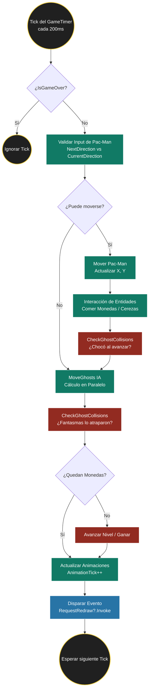

# PACMAN
El clásico juego  creado por Toru Iwatani de Namco en 1980 está recreado en C# utilizando Avalonia
para la UI y una arquitectura MVVM.

## 1.Models
**Aquí se definen los datos y las reglas fundamentales.**

- GameObject.cs: Clase base abstracta. Contiene las coordenadas X, Y. Permite tratar a cualquier objeto
    (muro, moneda, fantasma) de forma polimórfica en las listas de colisiones.

- Entities/Pacman.cs & Ghost.cs: Heredan de GameObject. El fantasma incluye estados (Normal, Vulnerable, InHouse).

- Entities/Wall.cs & GhostDoor.cs: Se separó la puerta del muro para que los fantasmas puedan atravesarla
mediante una comprobación de tipo en la lógica de colisiones.

- Enums/: Contiene Direction, GhostState, GhostType y GameMode. El uso de Enums evita el uso de "Magic Numbers"
o Strings, haciendo el código más legible y menos propenso a errores.

## 2. ViewModels
Es el puente entre los datos y la vista.

- GameViewModel.cs
Es la clase más compleja. Maneja el Game Loop.

## 3. Services 
- GameRenderer.cs: Responsable de "dibujar" el estado del ViewModel en el Canvas.

- CroppedBitmap: En lugar de cargar 50 imágenes individuales, usamos Sprite Sheets. 
Esto reduce el consumo de memoria y las llamadas al sistema de archivos al cargar el juego.

BitmapInterpolationMode.None: Crucial para mantener el estilo Pixel Art. Evita que Avalonia suavice (difumine)
las imágenes al escalarlas.

AudioPlayer.cs
Maneja la inmersión sonora. Para asegurar la portabilidad del proyecto entre los laboratorios de Jala University y
entornos de producción en Linux, se implementó un patrón de Estrategia por Plataforma. En lugar de forzar una librería
pesada como VLC o ManagedBass, el sistema detecta el OSPlatform en tiempo de ejecución y delega la reproducción al
subsistema de audio más cercano al hardware disponible.  Se Centraliza la carga de recursos de audio para evitar fugas
de memoria por abrir múltiples flujos de sonido simultáneamente.

## 4. Views (La Interfaz)
- **GameView.axaml:** Define el Canvas.

- Decisión técnica: Se activó UseLayoutRounding="True". Esto es vital para que los objetos se alineen perfectamente
a los píxeles del monitor y no se vean "dobles" o borrosos por estar en posiciones decimales.

- **MainMenuView.axaml & SettingsView.axaml:**

- Decisión técnica: Uso de Styles y Borders para simular la estética de una cabina de arcade clásica.

## 5. Decisiones Técnicas de Alto Nivel
- Thread Safety: Se utiliza un lock(_lock) dentro de Parallel.ForEach para mover fantasmas.

**Justificación:** Aunque los fantasmas se calculan en paralelo para mejorar el rendimiento, la modificación 
de sus coordenadas X e Y debe ser atómica para evitar condiciones de carrera.

- Sistema de Mapas (.txt):

**Justificación:** Permite crear niveles nuevos sin tocar una sola línea de código C#, cumpliendo con el Principio
de Abierto/Cerrado (Solid).

- Encapsulamiento de Colisiones (IsWall):

Justificación: Centralizar la lógica de "qué es sólido y qué no" en una sola función permite cambiar 
las reglas (como que los fantasmas atraviesen la puerta) de manera global y sencilla.

